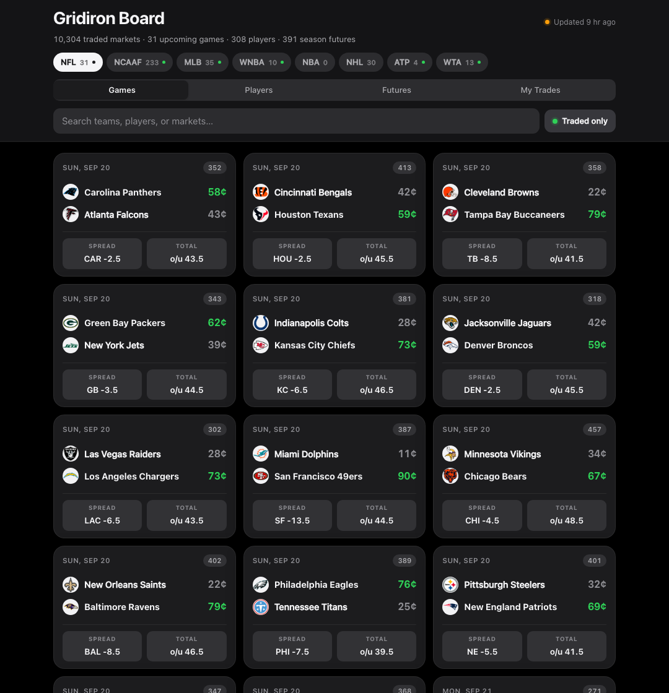

# Gridiron Board

Live prices for **every upcoming NFL market on Kalshi**, re-organised the way a
bettor actually thinks: by game, by bet type, by period, and by player.

Kalshi lists pro football across **342 separate market series**. Browsing that
on the exchange means clicking through hundreds of pages. This project pulls all
of it in one pass — **12,600+ open markets across 17 upcoming games and 150+
players** — and renders it as a single searchable board.



---

## How the API is called

The app talks to Kalshi's **public market-data API** (`https://api.elections.kalshi.com/trade-api/v2`)
using nothing but the Python standard library — `urllib.request` to make the
HTTP GET and `json` to decode it, wrapped in `kalshi_api.py`. Three endpoints do
the work: `GET /series?category=Sports` lists every market family (from which the
342 pro-football ones are filtered by ticker prefix), and
`GET /events?series_ticker=…&status=open&with_nested_markets=true` returns each
series' open events **with their child markets and live prices inlined** — that
last parameter is the important one, because it collapses what would be
thousands of requests into one per series. Responses are JSON objects whose
`markets[]` entries carry prices as **strings in dollars** (`"yes_bid_dollars": "0.6700"`),
which the code converts to the integer cents Kalshi's own UI displays (`67¢`);
pagination is handled by following the opaque `cursor` string each response
returns until it comes back empty.

### No API key required

**This project needs no API key, no account, and no authentication.** Kalshi's
market-data endpoints are fully public. That is a deliberate design choice: it
means there is no secret to leak, and the page can be hosted anywhere.

If you later extend this to *authenticated* endpoints (balances, orders), those
need an RSA key pair from Kalshi → Settings → API Keys. Put the key ID in a
`.env` file and the `.pem` outside the repo, and read them via environment
variables — `.gitignore` already blocks `.env` and `*.pem`. Never commit either.

### Why the browser doesn't call Kalshi directly

Kalshi's API returns **HTTP 403 to any request carrying an `Origin` header**, so
browser JavaScript cannot call it — there is no CORS access:

```
$ curl -s -o /dev/null -w "%{http_code}\n" \
    -H "Origin: https://example.com" \
    "https://api.elections.kalshi.com/trade-api/v2/markets?limit=1"
403

$ curl -s -o /dev/null -w "%{http_code}\n" \
    "https://api.elections.kalshi.com/trade-api/v2/markets?limit=1"
200
```

So the architecture is **Python fetches → JSON snapshot → static page renders**.
`fetch_nfl.py` writes `data/snapshot.json`; `js/app.js` reads that file. This
also keeps the live site keyless and free of any backend.

---

## Running it

Requires **Python 3.8+**. There is nothing to `pip install` — standard library only.

```bash
git clone https://github.com/saichaudhry/kalshi-nfl-board.git
cd kalshi-nfl-board

# 1. Pull current markets from Kalshi (~2 minutes, ~340 requests)
python3 fetch_nfl.py

# 2. Serve the folder and open it
python3 -m http.server 8000
#    then visit http://localhost:8000
```

Step 2 matters: opening `index.html` straight off the filesystem will **not**
work, because browsers block `fetch()` on `file://` URLs. The page says so if
you try.

Options:

```bash
python3 fetch_nfl.py --days 3      # only games within 3 days
python3 fetch_nfl.py --out foo.json
python3 fetch_nfl.py --quiet
```

---

## What it does with the data

Raw Kalshi structure is series → events → markets, which is built for the
exchange, not for a person. `classify.py` re-shapes it:

- **Join games across series.** `KXNFLSPREAD-26SEP17DETBUF`,
  `KXNFLTOTAL-26SEP17DETBUF` and `KXNFLPASSYDS-26SEP17DETBUF` all share the key
  `26SEP17DETBUF`, so spreads, totals and props collapse onto one game card.
- **Classify the bet.** Series tickers are parsed into a bet type (moneyline /
  spread / total / team total / player prop) and a period (full game, 1st half,
  3rd quarter, overtime), so `KXNFL1HSPREAD` becomes "Spread · 1st Half".
- **Find the players.** Prop titles read `Josh Allen: 175+ passing yards`, so the
  name is the prefix before the colon — filtered so that team defenses
  (`BUF Bills D/ST`), period labels (`Full Game: Over 53.5`) and escape options
  (`No Touchdown`) don't get mistaken for people. Each player's team is read out
  of the market ticker (`…-KCKWALKER9-80` → `KC`) rather than a hardcoded roster,
  so it survives trades.
- **Trim hard.** Raw markets carry ~40 fields each; only the 14 the UI renders
  are kept, which is the difference between a 40 MB and a 3.8 MB snapshot
  (≈270 KB gzipped over the wire).

The interface shows Kalshi's own conventions — prices in cents, where `67¢`
means the market thinks it's 67% likely, with YES/NO both quoted — plus a
probability bar and the price change since the previous close.

---

## When things go wrong

Deliberately tested failure modes:

| What breaks | What happens |
| --- | --- |
| No internet | Fetcher prints `Could not reach Kalshi: …`, exits `1`, and **leaves the existing snapshot in place** so the site still renders |
| Kalshi rate-limits (429) or 5xx | Retried three times with exponential backoff |
| One series 404s or errors | Skipped and recorded in `problems[]`; the other 341 still finish |
| Malformed JSON | Raises a clear `KalshiError` naming the URL |
| Off-season, no NFL markets | Page shows "No open NFL markets — this is normal between February and August" instead of a blank screen |
| Snapshot missing | Page explains how to generate it and why `file://` fails |
| Search matches nothing | Friendly empty state per tab, not an empty page |
| Interrupted mid-write | Snapshot is written to a `.tmp` file and atomically moved, so it is never half-written |

---

## Design notes

The interface follows Apple's interaction guidance: feedback fires on
*pointer-down* rather than release; the translucent header is a real material
(`backdrop-filter`) that content scrolls beneath rather than an opaque bar;
disclosure uses a `grid-template-rows` transition on Apple's critically-damped
`cubic-bezier(0.32, 0.72, 0, 1)` curve so cards open to their true height with no
overshoot; type uses size-specific tracking (tightened to `-0.024em` on the
heading, opened to `+0.055em` on small uppercase labels); and prices are set in
tabular figures so they don't reflow as they tick. `prefers-reduced-motion`,
`prefers-reduced-transparency` and `prefers-contrast` are all honoured, and the
whole palette is token-driven so light and dark are defined once each.

## Files

```
fetch_nfl.py    entry point: walks every NFL series, writes the snapshot
kalshi_api.py   HTTP client — pagination, retries, offline vs. server errors
classify.py     game keys, bet types, periods, player-name extraction
index.html      page shell
css/app.css     design tokens + layout
js/app.js       rendering, filtering, search
data/snapshot.json   generated — commit it so the site works without Python
```

---

Prices from the Kalshi public market-data API. Not affiliated with Kalshi.
Built for CMU 15-113; for coursework, not for trading.
